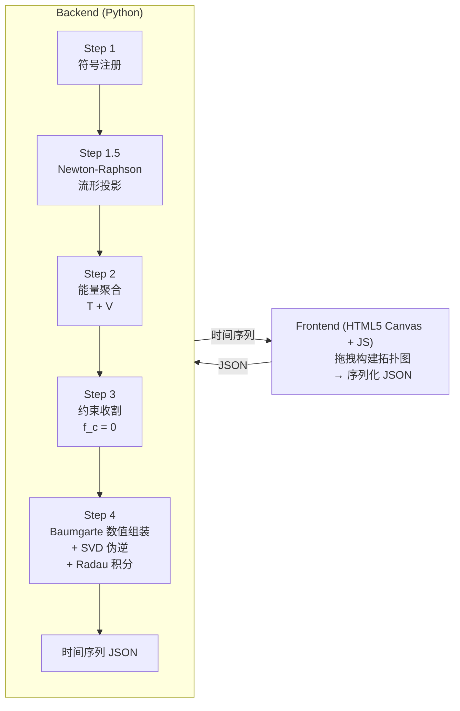

# Ideal Mechanics Parser

**物理竞赛级理想力学解析器** — 基于最大坐标法 + SymPy 符号推导 + SciPy 隐式积分的多体动力学解算引擎。

## Architecture



### 数值装甲三件套 (Numerical Armor Triad)

1. **流形投影** — Newton-Raphson 将初始坐标投影到约束流形
2. **Baumgarte 稳定化** — $\ddot{f}_c + 2\alpha\dot{f}_c + \beta^2 f_c = 0$ 消除约束漂移
3. **SVD 伪逆** — 冗余约束时用 `np.linalg.pinv` 免疫奇异矩阵

## Requirements

- Python >= 3.10
- sympy >= 1.12
- scipy >= 1.11
- numpy >= 1.24

## Installation

```bash
cd ideal_mechanics_parser
pip install -r requirements.txt
```

## Quick Start

```bash
python main.py examples/single_pendulum.json
```

输出为 `output/single_pendulum_trajectory.json`，包含时间序列坐标矩阵。

### 单摆示例

```json
{
  "system_env": {
    "view_plane": "XY",
    "gravity": 9.81,
    "time_step": 0.01,
    "duration": 10.0
  },
  "nodes": [
    {"id": "n1", "type": "Anchor", "init_pos": [0, 5]},
    {"id": "n2", "type": "MassPoint", "params": {"m": 1.0}, "init_state": {"x": 3, "y": 1, "vx": 0, "vy": 0}}
  ],
  "edges": [
    {"id": "e1", "type": "IdealRod", "from": "n1", "to": "n2", "params": {"length": 5.0}}
  ]
}
```

## Entity Library

| Entity | Type | Description |
|--------|------|-------------|
| Anchor | Node | 固定锚点，零自由度 |
| MassPoint | Node | 质点，笛卡尔自由度 $(x, y)$ |
| IdealRod | Edge | 理想轻杆，等距约束 $(x_1-x_2)^2+(y_1-y_2)^2 = L^2$ |
| IdealSpring | Edge | 理想弹簧，弹性势能 $V_k = \frac{1}{2}k(d - l_0)^2$ |
| SmoothRail | Edge | 光滑轨道，隐式方程约束 $f(x, y) = 0$ |
| FixedCoordinate | Edge | 固定坐标约束 $x_i = c$ 或 $y_i = c$ |
| LinearRelation | Edge | 广义线性关系 $a_1 x_1 + b_1 y_1 + a_2 x_2 + b_2 y_2 + c = 0$ |
| DistanceSum | Edge | 滑轮/绳约束 $\|p_1 - p_a\| + \|p_2 - p_a\| = L$ |
| AngleConstraint | Edge | 定向约束 $(x_2-x_1)\sin\theta - (y_2-y_1)\cos\theta = 0$ |

## Roadmap

- **Phase 1** ✅: 纯等式约束 + 数值装甲 + 新约束扩展
- **Phase 2** 🔄: 刚体 + 碰撞事件 + 软绳（中断-重构-重启）
- **Phase 3** 📋: 摩擦 LCP 平行引擎 + 黑盒寻优 API

## Documentation

- [Core Architecture](../docs/core_architecture.md) — 架构设计 + 图元库
- [Backend Pipeline](../docs/backend_pipeline.md) — 5步流水线详述
- [P1 Features Spec](../docs/p1_features.md) — 约束类型 + 逃生舱 + 时间真相
- [Frontend Spec](../docs/frontend_spec.md) — 前端 JS 架构
- [Test Spec](../docs/test_spec.md) — 测试规范
- [Roadmap](../docs/roadmap.md) — 阶段演进路线
- [P1 Enhancement Plans](../docs/P1/) — 后稳定投影、参数可配置
- [P2 Research Notes](../docs/P2/) — 软绳、碰撞
- [P3 Research Notes](../docs/P3/) — LCP、辛积分器

## License

MIT
